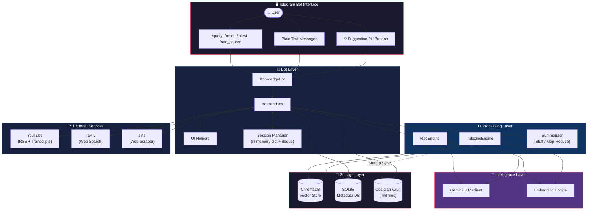

# 🧠 Knowledge Pipeline: Autonomous Research Agent

An intelligent "Second Brain" assistant that autonomously collects, synthesizes, and archives deep research from various media sources into a local Obsidian vault — then lets you **have multi-turn conversations with your own knowledge** using a RAG-powered conversational engine.

## 🏛️ System Architecture



## 🚀 The Workflow

### Phase 1 — Collect & Synthesize
1. **Source Collection**: Add YouTube channels via `/add_source` and fetch latest videos with `/latest`.
2. **Autonomous Research**: The agent expands summaries into multiple search angles via **Tavily**.
3. **Smart Scraping**: **Jina AI** scrapes content while a **3-Layer Defense** filters out junk/404s.
4. **Dual-LLM Synthesis**: 
   - **Ollama - gemma3:4b** (Local) handles initial mapping and extraction.
   - **Gemini 2.5 Flash** (Cloud) performs the final high-quality reduction.
5. **Obsidian Archival**: A beautifully formatted Markdown report is saved to your local vault with top-source citations.

### Phase 2 — Index & Query
6. **Auto-Indexing**: On startup, the bot scans your entire Obsidian vault, chunks each note, and embeds them into **ChromaDB**.
7. **Semantic Search**: Use `/query` to ask natural language questions against your vault.
8. **Distance Filtering**: Only truly relevant results (distance < 1.3) are used — irrelevant matches are filtered out.
9. **Grounded Answers**: Gemini generates answers strictly from your vault data, with hallucination-free source citations stapled to every response.

### Phase 3 — Conversational RAG
10. **Multi-Turn Chat**: After `/query`, the bot enters "chat mode" — type freely without commands for a natural research conversation.
11. **Query Condensation**: Follow-up questions like *"Tell me more about that"* are automatically rewritten into precise standalone search queries using conversation history.
12. **5-Turn Memory**: A rolling context window keeps the last 5 exchanges, enabling coherent back-and-forth discussions.
13. **Suggestion Pills**: After every answer, 3 auto-generated follow-up buttons (💡💡🔭) guide deeper exploration — 2 vault-grounded, 1 horizon expander.
14. **Session Reset**: Use `/reset` to clear context and start a fresh research thread.

## ✨ Key Features

| Category | Feature |
|---|---|
| **Research** | Autonomous multi-source ingestion with Tavily search + Jina web scraping |
| **Synthesis** | Hybrid Stuff/Map-Reduce summarization for any transcript length |
| **RAG Search** | Semantic search with distance-based relevance filtering (threshold: 1.3) |
| **Honesty Policy** | 3-tier response strategy — vault-grounded → partial → general knowledge with clear disclaimers |
| **Citations** | Bot-side verified URLs from ChromaDB metadata — LLM never writes a URL |
| **Conversation** | Multi-turn chat mode with per-user session tracking |
| **Query Rewriting** | LLM-powered condensation turns vague follow-ups into precise vector searches |
| **UI Pills** | Auto-generated suggestion buttons parsed from structured LLM output (`\|\|\|` separator) |
| **Memory** | 5-turn rolling `deque` history injected into both search and generation |
| **Resilience** | Markdown fallback, callback truncation (64-char limit), emoji-safe console output |
| **State Management** | SQLite-backed tracking prevents duplicate research; content hashing skips re-indexing |
| **Metadata** | Obsidian frontmatter (title, tags, source, date) preserved alongside embeddings |

## 🛠️ Tech Stack

| Layer | Technology |
|---|---|
| **Language** | Python 3.x (Asyncio) |
| **Interface** | Telegram Bot API (`python-telegram-bot` v22+) |
| **Research** | Tavily Search & Jina AI Reader |
| **LLMs** | Google Gemini 2.5 Flash (Cloud) & Ollama gemma3:4b (Local) |
| **Embeddings** | Ollama (nomic-embed-text) |
| **Vector Store** | ChromaDB (Persistent, Local) |
| **Text Splitting** | `langchain-text-splitters` + `tiktoken` |
| **Database** | SQLite (aiosqlite) |
| **Knowledge Base** | Obsidian (Local Filesystem) |
| **Package Manager** | `uv` |

## 🤖 Bot Commands

| Command | Description |
|---|---|
| `/start` | Welcome message and bot introduction. |
| `/add_source <id> <name>` | Add a YouTube channel to monitor. |
| `/sources` | List all tracked sources. |
| `/latest` | Fetch, summarize, and archive new videos from all sources. |
| `/query <question>` | Start a conversation — ask a question against your Obsidian vault using RAG. |
| `/reset` | End the current chat session and clear conversation history. |

> **💬 Chat Mode**: After `/query`, you can type follow-up questions directly — no need to prefix with `/query` again. The bot stays in conversational mode until you `/reset` or use another command.

## 🏗️ Project Structure

```
src/
├── bot/
│   ├── knowledge_bot.py      # App wiring, lifecycle hooks, handler registration
│   ├── handlers.py            # All command & callback logic (start, latest, query, chat, reset)
│   └── ui_helpers.py          # Pure UI utilities (loaders, keyboards, cast helpers)
├── processing/
│   ├── summarizer.py          # Dual-LLM Map-Reduce summarization pipeline
│   ├── researcher.py          # Tavily search + Jina web scraping orchestrator
│   ├── indexing_engine.py     # Vault scanner, chunker, and embedding upserter
│   ├── rag_engine.py          # Query rewriting, vector search, LLM synthesis, suggestion parsing
│   ├── embedding_engine.py    # Embedding model abstraction (Nomic via Ollama)
│   └── chunk.py               # Text chunking strategies (Markdown-aware)
├── adapters/
│   ├── llm/                   # Gemini & Ollama LLM clients (BaseLLMClient interface)
│   └── sources/               # YouTube transcript adapter (RSS + youtube-transcript-api)
├── storage/
│   ├── database.py            # SQLite async database (sources, content, summaries)
│   ├── vector_store.py        # ChromaDB wrapper (upsert, retrieve with metadata & distances)
│   ├── obsidian.py            # Obsidian vault file manager (frontmatter + MD)
│   └── models.py              # Data models (SourcePlatform, SourceContent, ContentSummary)
├── core/
│   ├── factory.py             # Dependency injection & app assembly
│   └── container.py           # AppContainer (holds all service instances)
├── settings/
│   ├── settings.py            # Settings dataclass
│   └── load_settings.py       # Environment loader (.env → Settings)
├── utils/
│   └── constants.py           # All prompts (RAG, Condensation), messages, and string templates
└── main.py                    # Entry point (startup indexing + bot launch)
```

## 📊 Example Research Output

Every research task generates a structured Markdown file with frontmatter, categorical analysis, and verified sources:

```markdown
---
title: "The Real Reason SpaceX is Buying Cursor"
source: https://www.youtube.com/watch?v=vwme_LkfMgE
created: 2026-04-27
tags: [research, knowledge-pipeline]
---

## Overview
This document details systems for efficient code indexing, RAG for LLMs, and safe alignment...

## How It Works
- Codebases are indexed using **Merkle trees** for efficient synchronization.
- A RAG pipeline uses code embeddings stored in a vector database (e.g., Turbopuffer).

## Sources: 
- https://read.engineerscodex.com/p/how-cursor-indexes-codebases-fast
- https://medium.com/coinmonks/merkle-tree-a-simple-explanation-and-implementation-48903442bc08
```
*Built for deep thinkers and knowledge workers.*
